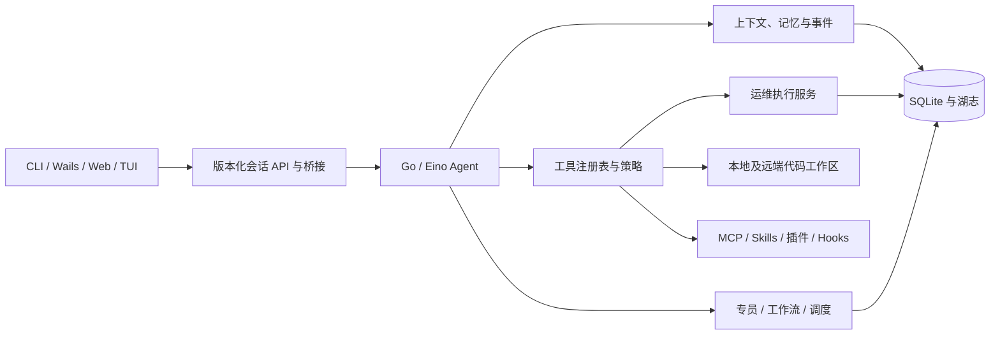

# Lake 设计文档

Lake 是本机单用户的运维与代码 Agent。它以 Go/Eino 作为唯一 Agent 运行时，在 SQLite 中保存湖、资源、授权、会话、工作流和湖志；CLI、Wails 桌面、只读 Web 与文字 TUI 使用同一数据与事件协议。ZCode 能力迁移的范围和验收项见[迁移方案](../plan/architecture-zcode-lake-1.md)及[能力矩阵](zcode-capability-matrix.md)。

## 1. 分层

`lake/store/` 不依赖 Agent、模型、扩展或 UI。`lake/operate/` 负责运维资源的最后执行裁决，`lake/agent/policy/` 负责工具能力、范围和审批决策。专员继承父任务的湖、资源、项目与工具范围，交集只会缩小。`cmd/lake/` 装配共享运行时；桌面通过签名 CLI 桥接，不另起 Node/TypeScript Agent。

## 2. 数据与凭据

一汪“湖”包含运维资源、资源关系、附属物与湖志。资源 ID 在会话开始时冻结；查询到更多资源不扩大可操作范围。主机、Kubernetes 与数据库资源的连接元数据在 SQLite，执行授权按资源分别保存。运维命令、风险、审批和结果以同一 `action_id` 写入追加式湖志；结果可能已发生而本机无法确认时记为 `unknown`。

数据库 schema 目前为 v18。v1–v7 数据原样保留；v8 增加会话事件与摘要并回填旧对话，v10 增加可控记忆，v12–v15 增加扩展、专员、工作流与计划，v16 增加独立授权的远端代码工作区，v17 兼容补齐早期会话事件表的 tool_call_id，v18 增加工作流目录、层级与排序。组织信息独立于 v1/v2 定义，事务内验证所属湖及目录循环，移动不会影响运行快照。旧 `conversation_turn` 和旧工作流表仍可读、可运行。升级前对已有数据库创建权限为 `0600` 的一致性备份；[去敏样本](../lake/testdata/migrations/README.md)覆盖 v1–v16 的升级与失败恢复。

模型 API Key、SSH 私钥及 MCP 凭据保存在 `~/.lake/secrets/`，目录为 `0700`、文件为 `0600`；SQLite 仅保存引用，不保存秘密原文。正常运行不读取 Keychain。旧版本用户只可从已签名的 `bin/lake` 显式运行一次 `lake secrets migrate`，将旧 Keychain 项迁往私有文件。用户须按原始凭据强度保护该目录及其备份。

## 3. Agent 与权限

会话同时保留旧消息与版本化事件。事件包括用户与助手预览、工具提出/批准/结束、模型用量、摘要、专员和工作流进度；持久字段经白名单与大小限制，不能将任意工具参数或授权头写入事件。上下文接近模型预算时压缩较早消息，并保留最近消息和来源事件 ID。跨会话记忆默认关闭，可按湖/项目启用、查看和删除。

所有工具经注册表校验名称、输入 schema、可见范围、超时和输出上限。写文件、本机 Shell、远端命令、外部 MCP 工具与 Hook 默认逐次批准。无人值守工作流只能在精确预授权覆盖当前工作流版本、节点、资源、命令哈希、有效期和次数时执行指定 SSH 命令；其他写动作进入 `waiting_approval`。批准之后执行服务重新读取授权，不把模型或扩展的说法当成权限。

主机 SSH 校验 `known_hosts`；只读检查使用固定模板，其他命令按风险规则处理。Kubernetes 与数据库 Agent 工具只提供受限查询。远端代码工作区授权独立于主机执行授权，绑定规范物理根目录；文件读写限制路径、大小和 UTF-8，写入要求旧 SHA-256。断线后的远端写入和命令标记未知，不能自动重试。本机 Shell 和用户明确批准的远端命令并非操作系统沙箱。

## 4. 扩展、专员与工作流

模型协议包括 Anthropic Messages、OpenAI Chat Completions 和 OpenAI Responses。可配置 SearXNG 搜索、允许域名内的 Web 抓取及显式文本页面会话；外部页面和 MCP 返回值均作为不可信资料。浏览器适配器没有 JavaScript、Cookie、文件或 SSH 凭据访问。项目内 PDF 文本、桌面 PDFKit 预览及 AVFoundation 视频关键帧受页数、字节、帧数和尺寸限制；原视频/PDF 不保存到会话。

MCP 使用官方 Go SDK，支持 stdio 和 Streamable HTTP；凭据仅在连接时进入受限传输环境。Skills 需显式加载，插件需校验来源摘要并显式启用，工作区 Hooks 默认关闭且每次执行仍须批准。已启用且摘要有效的插件在新会话装配 MCP 和 Hook；包内执行文件必须在 assets 清单中声明。会话中停用、版本切换或文件变化会阻断后续调用。

内置 SSH、代码与自定义专员共用受限专员运行器；自定义配置支持独立模型、工具白名单和湖/项目/资源范围。任务状态与摘要保存在 SQLite，执行上下文与模型/工具边界在私有检查点原子保存；恢复复用已完成结果，未知写操作需要显式允许重试及重新审批，结果交回主 Agent。旧 `SpecialistCall` 仍可读取。旧版运维工作流继续按 v1 定义运行；v2 提供五类类型化节点、依赖/条件、最多 32 个展开节点、最多 4 个并行节点、结果引用和持久恢复。写节点在中断后为未知，只有显式要求才能重试。调度器支持一次性和 cron 计划，SQLite 事务认领到期点，租约过期暂停并记录未知；macOS LaunchAgent 仅指向签名后的 CLI。

## 5. 用户入口与构建

`lake` 无参数进入交互对话；`lake tui` 是只读文字工作台；`lake web serve` 默认监听 `127.0.0.1:8765` 并提供只读会话 API。非回环 Web 访问须配私有令牌、受信 HTTPS Origin 和 TLS。Wails 桌面显示会话、审批、湖与资源、专员、工作流、扩展状态、Git/终端/文件树和远端代码工作区。审批由发起动作的交互入口处理，只读入口不执行操作。

macOS 用户版 CLI 必须用 `scripts/build_lake.sh` 构建并以持久的 `Lake Local Development Code Signing` 身份签名。`scripts/build_lake_desktop.sh` 打包签名 CLI 和 Wails 应用，默认只输出到 `~/Library/Application Support/Lake/builds/`；`--install` 才安装到 `~/Applications`，并保留既有应用备份。`scripts/verify_lake_release.sh` 执行测试、静态检查、前端构建、两种签名构建及迁移样本回归。第三方组件说明见[许可说明](third-party-notices.md)，安全威胁回归见[安全清单](security-threat-regression.md)。

## 6. 发布边界

首发面向 macOS 本机单用户。Z.ai 账号、计费、遥测、云分享、Electron 壳和 Node Agent 不在 Lake 的目标内。文本浏览器不支持交互式网页；Web 与 TUI 目前只读。工作流 v2 桌面管理覆盖定义编辑、校验、预览、修订、运行、节点/事件与恢复，详见[四项闭环说明](migration-closure.md)。真实模型服务、实际 SSH 断线和用户 LaunchAgent 安装须在目标环境另行验收。
