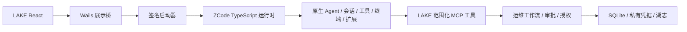

# LAKE 架构

LAKE 是 ZCode 源码中的运维数据与工作流模块。用户继续使用当前前端。

数据层唯一归属 `@zcode/lake`。ZCode 拥有通用执行能力；LAKE 不维护第二套 Agent、代码工具、终端接管、子 Agent 或扩展执行引擎。Go 不导入业务框架、数据库或 SSH 执行服务。

审批不能替代资源授权。运维动作在审批前冻结范围，执行前再次核对身份与授权，并写入湖志。结果不确定的已派发写操作不会自动重放。计划授权绑定工作流版本、节点、主机、命令摘要、有效期与次数。
