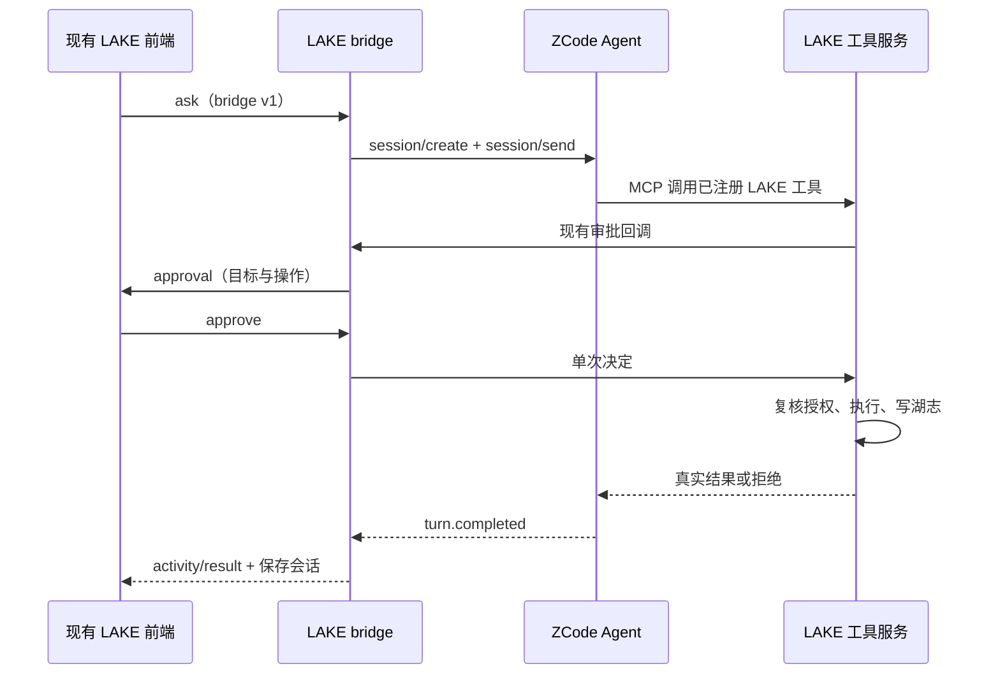

# 保留 LAKE 前端的 ZCode Agent 接入契约

本分支保留 `client/desktop` 的 Wails/React 前端以及 bridge v1 协议。桌面 `lake bridge` 默认使用从开源源码构建的 ZCode 主 Agent；命令行对话和既有 Go 专员/工作流执行服务继续可用。`lake bridge --agent-runtime eino` 是显式选择旧主 Agent 的入口，ZCode 启动失败时不静默切换。



## 所有者与边界

- LAKE bridge 唯一接收桌面输入并保存用户会话、审批、工具和结果事件。ZCode 每轮使用临时会话执行模型/工具循环，结束后关闭；不向现有前端引入第二套持久会话数据库。
- ZCode 只调用当前 LAKE 工具注册表导出的 MCP 工具，工具范围和许可保持由 LAKE 裁决。当前湖、项目、专员、工作流及附件仍从 LAKE 服务装配。
- 已注册工具在 ZCode 侧可以免去重复的原生审批，因为它们的执行仍经过 LAKE 现有审批回调及最终授权复核。模型参数不能代替批准。
- 内置 Shell、文件操作、浏览器、其他 MCP、自动调度等 ZCode 工具不开放。模型代理额外校验请求中的工具名，拒绝未注册工具。
- API Key 只保留在 Go 主进程，通过随机令牌保护的回环模型代理访问原提供方；ZCode 配置只有本轮代理令牌。MCP 回环入口也使用该令牌，不绑定外网。
- Go 工具服务直接调用已有审批通道，无须安装版 ZCode 尚缺的服务器 elicitation。因此不能将 ZCode 原生工具许可当作 LAKE 执行许可。
- LAKE 每轮沿用同一个前端请求 ID；不同轮不能相互批准。关闭 bridge 会取消模型、子进程和工具。未知结果不自动重放。
- 工具开始/结束沿用同一工具调用 ID。工具返回错误仍通过 `isError` 和原始安全结果传播，不因 ZCode 协议结束就展示为运维成功。

## 构建与配置

源码固定在 `third_party/zcode`，来源见 `third_party/ZCODE-UPSTREAM.md`。Agent 构建入口为 `scripts/build_zcode_agent.mjs`，使用 Node 24.14.0 和锁文件安装 CLI 依赖，产物进入已忽略的 `bin/zcode`。LAKE CLI 仍只用 `scripts/build_lake.sh` 构建签名。

可用 `LAKE_ZCODE_CLI` 指定显式 CLI 路径，`LAKE_ZCODE_NODE` 指定 Node 路径；默认使用 `bin/lake` 同目录 `zcode/` 下的构建产物与 Node。路径缺失直接报告构建命令，不使用系统安装的 ZCode 作为隐式替代。

模型协议沿用现有配置的 `anthropic`、`openai_chat`、`openai_responses`。代理只转发对应的 Messages、Chat Completions 或 Responses 路径，不提供通用网络转发。真实模型和 SSH 凭据不写入 Node 配置、标准输出或仓库。

上下文窗口、输出 Token 上限、推理档位和图片输入沿用 LAKE 配置。界面连续两次校验失败后，模型请求撤下全部工具并进入现有 Markdown 整理指令；主机工具入口也拒绝后续执行。ZCode 遥测导出关闭，运行配置不继承用户的外部遥测或模型环境变量。

## 验收

1. 现有 React 源码无替换；前端测试和构建通过。
2. 从固定开源源码构建 Agent，运行 `app-server`；测试不依赖 `/Applications/ZCode.app`。
3. bridge v1 的 ready、ask、activity、approval、approve、result 和会话恢复继续工作。
4. 本机模型 fixture 引导真实 ZCode 调用 LAKE 工具；批准执行一次，拒绝/撤权不执行；湖志及界面事件保持关联。
5. 假模型验证凭据只在 Go 代理与原提供方之间使用，Node 配置无真实 API Key。
6. 会话关闭和错误路径不留下子进程、不重复调用已执行工具。

运行自动化联调：

```sh
LAKE_ZCODE_INTEGRATION=1 go test -race ./lake/zcode ./cmd/lake -run 'TestSource|TestHost|TestModelProxy|TestProviderKey' -count=1
```

测试使用本机模拟模型和临时湖数据；SSH 调度使用计数 fixture 验证，未把它计作真实服务器联调。设置 `LAKE_ZCODE_CLI`、`LAKE_ZCODE_NODE` 可对签名桌面包内的运行时重跑同一验收。

现有 Go 专员内部模型循环尚未替换为 ZCode 子 Agent；这属于独立后续改动，不影响本分支主 Agent 接入。保留 Eino 组件用于这些服务及会话摘要，并不将其计作 ZCode 专员验收。
