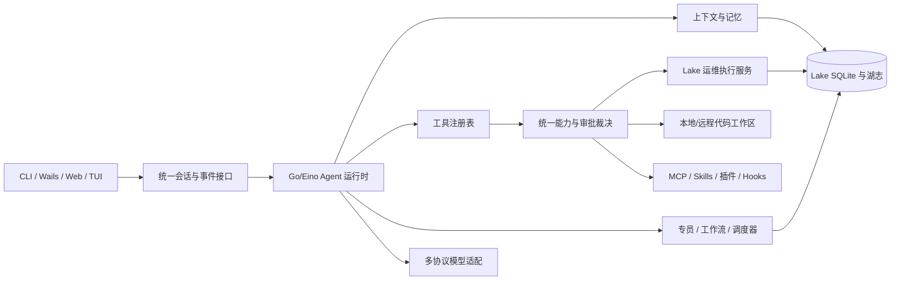

# Introduction

2026-10-01 后续决定：用户要求保留现有前端并引入开源 ZCode。当前分支的主 Agent 按[新接入计划](feature-zcode-runtime-1.md)使用 Node 源码运行时；本文件保留为之前 Go 能力迁移的历史记录，其单运行时约束不再适用于新分支。LAKE 凭据、审批和数据层边界继续有效。

本方案以 ZCode 提交 `29628c9acdb81b703bbd4080c207a0e7ce5e276e` 为能力基线，以 2026-09-30 的 Lake 工作区为实现基线。目标是**能力迁移**：保留 Go/Eino 作为唯一 Agent 运行时，继续使用 SQLite 运维数据层、Wails 桌面壳和 Lake 的凭据/SSH 审批链；参考 ZCode 的行为与边界，在 Go 中实现相应模块。不引入 Node/TypeScript Agent 进程，不复制 Electron 桌面壳。

交付分为三个可独立使用的版本：**R1 Agent 内核**（会话、上下文、权限、代码工具、多协议模型），**R2 扩展与编排**（MCP、Skills、插件、通用专员、动态工作流、定时运行），**R3 工作台**（Web/TUI、Git/终端、远程代码工作区）。每个版本须满足本文件的验证门槛才能进入下一版本。各阶段实施时再拆成小型任务计划；本文件是跨子系统的总体方案和验收契约。

**术语约定**：ZCode 源码中的 `subagent` 是上游能力来源；Lake 将主 Agent 委派任务、限定模型/工具/资源范围并在完成后交回结果的角色称为**专员**。现有 SSH 专员、代码专员是内置专员，R2 扩展为可配置的通用专员。用户界面、CLI、API 事件及新增持久化结构使用“专员”/`specialist`；已有 `conversation_turn.specialists` 与 `SpecialistCall` 保持兼容。专员不能自行扩大父任务权限或绕过执行服务。

工作量粗估为 R1 **8–12 工程周**、R2 **12–18 工程周**、R3 **12–20 工程周**，另留 **3–5 工程周**完成跨版本联调与发布；工程周指一名熟悉 Go/React 的工程师工作一周。估算依据是本仓库的现有接口及下列任务拆分，尚未包含真实模型服务或远端环境接入时的不确定耗时，不作为发布日期承诺。

## 目标边界与现状

| 领域 | Lake 当前入口 | 目标结果 | ZCode 固定来源 |
| --- | --- | --- | --- |
| Agent 与会话 | `cmd/lake/chat.go`、`lake/store/conversation.go`；恢复最近 20 条消息 | 持久化事件、可恢复工具链、自动上下文压缩与可控记忆 | `apps/zcode-cli/packages/core/src/agent/`、`compact/`、`memory/` |
| 工具与审批 | `cmd/lake/code_agent.go`、`lake/operate/ssh.go`；固定工具和逐次批准 | 统一工具注册、能力声明、审批裁决、输出预算与审计 | `apps/zcode-cli/packages/core/src/tool/`、`permission/` |
| 模型 | `lake/model/anthropic.go`；仅 Anthropic Messages 协议 | Anthropic Messages、OpenAI Chat Completions、OpenAI Responses | `packages/provider/`、`apps/zcode-cli/packages/adapters/src/model/` |
| 扩展 | `cmd/lake/chat.go` 静态装配 | MCP、Skills、插件与受控 Hooks | `apps/zcode-cli/packages/adapters/src/mcp/`、`skills/`、`plugins/` |
| 编排 | `cmd/lake/ssh_agent.go`、`code_agent.go`、`lake/workflow/` | 通用专员、类型化工作流、恢复与定时运行 | `apps/zcode-cli/packages/core/src/subagent/`、`apps/zcode-cli/packages/dynamic-workflow/` |
| 工作台 | `client/desktop/` Wails + React、CLI JSON Lines bridge | 共享服务协议、Web/TUI、Git/终端/文件树、远程代码工作区 | `packages/server/`、`services/`、`ui/`、`web/`、`desktop/`、`apps/zcode-cli/packages/tui/` |

目标不包括 Z.ai 账号、订阅/计费、官方遥测/反馈、云同步与分享业务；这些是 ZCode 产品服务，不属于 Lake 单用户本地 Agent。ZCode 仓库的 Computer Use 包目前是不可用占位实现，不列为可迁移的现成功能。Windows/WSL 支持在 macOS 版本稳定后单独规划；R3 的远程工作区先覆盖 macOS 客户端连接 Linux SSH 主机。

## 1. Requirements & Constraints

- **REQ-001**: 所有 Agent 入口共用 `lake/agent` 的会话、工具、策略与事件接口；CLI、Wails、Web 和 TUI 不各自实现执行权限。
- **REQ-002**: 旧 `conversation_turn` 和运维工作流数据可无损读取；数据库升级只追加版本化迁移，不删除原表或覆盖原始内容。
- **REQ-003**: R1 提供长会话压缩、完整的工具调用事件、代码修改预览/差异/检查点和三种模型协议；未返回模型用量时以明确的估算标记展示。
- **REQ-004**: R2 提供本地 stdio 与 Streamable HTTP MCP、可发现的 Skills、显式安装的插件、默认关闭的 Hooks、可恢复的通用专员与类型化工作流。
- **REQ-005**: R2 工作流支持 `ssh_check`、`ssh_command`、`code_task`、`specialist_task`、`tool_call` 五类节点；`code_task` 调用内置代码专员，`specialist_task` 指定专员配置。支持依赖、条件、至多 32 项的有界扇出、并行汇合、结果引用、显式恢复；旧工作流定义按 v1 运行。
- **REQ-006**: R2 调度器支持一次性和 cron 触发、到期原子认领、单实例执行、错过执行记录和失败退避，并可作为 macOS LaunchAgent 在桌面窗口关闭后运行。无人值守默认只执行只读步骤；计划中的写步骤仅在有未过期、绑定工作流版本/资源 ID/确切命令哈希/运行次数的用户预授权时执行，否则进入 `waiting_approval`。任何可能产生副作用的步骤不得自动重试。
- **REQ-007**: R3 提供本机 Web、TUI、桌面 Git/终端/文件树与远程代码工作区；Web 默认只监听回环地址，非回环访问要求令牌和受信传输。
- **SEC-001**: 模型 API Key 与 SSH 私钥只从 `~/.lake/secrets/` 读取，保持 `0700/0600`；不得打印、记录到 SQLite、传给模型、MCP 服务器、插件或前端。正常运行不读取 Keychain；只有用户显式调用的、已签名的 `lake secrets migrate` 可读取旧 Keychain 项。
- **SEC-002**: `operate.Service` 保持资源 ID 冻结、`execute_authz`、主机密钥校验、命令风险判定、人工批准和湖志写入的最终裁决权。专员、工作流和定时任务只能缩小作用域。
- **SEC-003**: 本地文件写入、Shell、远端命令、MCP 非只读工具及 Hook 执行默认逐次批准；无交互审批通道且无符合 `REQ-006` 的限定预授权时拒绝或等待。预授权只覆盖指定工作流的确切 SSH 命令，不覆盖本地 Shell、MCP、Hook 或代码写入，也不能绕过 `SEC-002`。
- **SEC-004**: 工具参数、外部网页/MCP 返回值、Skill 文本、Hook 输出与工作流结果作为不可信内容处理；持久化事件只保存受限大小的脱敏预览、状态、摘要及引用。
- **CON-001**: macOS 用户可执行的 `bin/lake` 只能由 `scripts/build_lake.sh` 构建并用固定的 `Lake Local Development Code Signing` 身份签名；身份缺失先运行 `scripts/setup_lake_signing.sh`，不能退回未签名构建。
- **CON-002**: 根模块目前声明 Go 1.18，Wails 模块声明 Go 1.25。ZCode 固定提交支持 MCP `2026-07-28`；完整支持该协议的官方 Go MCP SDK v1.7.0 要求 Go 1.25。R1 开始前显式验证并升级根模块到 Go 1.25，不能在引入依赖时隐式抬高工具链。
- **CON-003**: Lake 的 SQLite `store` 保持不依赖 Agent、模型、MCP 或前端包；模型和工具通过接口调用数据层。
- **CON-004**: 不把 ZCode TypeScript/Node 运行时作为辅助进程；工作流脚本能力使用 Go 的类型化规范与编译校验实现，不承诺兼容 ZCode 的 TypeScript 脚本语法。
- **GUD-001**: 每一阶段保留现有 CLI 行为，并提供旧版数据的迁移回归测试及可读错误；只有对应功能通过验收后才在 UI 中显示入口。
- **PAT-001**: 执行链为“模型提出工具调用 → 注册表验证输入 → 能力策略裁决 → 用户批准（如需）→ 执行服务再次校验 → 事件与湖志落盘 → 有上限的结果返回模型”。

## 2. Implementation Steps

### Implementation Phase 0 — 基线、工具链与契约（R1 前置）

- **GOAL-001**: 固定上游基线并验证 Go 1.25 可以编译、测试和签名 Lake；定义跨入口共享的契约。完成判据：`go test ./...`、`go vet ./...`、前端构建和 `scripts/build_lake.sh` 全部通过，`codesign --verify bin/lake` 通过。

| Task | Description | Completed | Date |
| --- | --- | --- | --- |
| TASK-001 | 新建 `docs/zcode-capability-matrix.md`，逐项记录本文件目标、ZCode 固定提交、Lake 现状、目标版本与验收用例；为每项标注“已覆盖/待建/明确排除”，将该文件作为后续变更审查的基线。 | ✓ | 2026-09-30 |
| TASK-002 | 将根 `go.mod` 的 `go` 指令显式改为 `1.25.0`，锁定 Go 1.25 工具链；运行全量 Go 测试与 vet，记录根模块中与 Go 1.25 不兼容的包并在本任务内修复，不触及 Lake 之外的 Eino 公共 API。 | ✓ | 2026-09-30 |
| TASK-003 | 新建 `lake/agent/contracts.go`，定义 `SessionID`、`ToolCallID`、`AgentEvent`、`ToolSpec`、`PermissionRequest`、`PermissionDecision`、`RunScope`；新建 `lake/agent/contracts_test.go`，验证 JSON 编解码及 scope 交集规则。 | ✓ | 2026-09-30 |
| TASK-004 | 在 `cmd/lake/bridge.go` 增加协议版本请求/响应和单调递增事件序号；保留现有 `ask/approve/result` 事件直到 R3 客户端完成迁移。用 `cmd/lake/bridge_test.go` 覆盖旧客户端与新客户端。 | ✓ | 2026-09-30 |

### Implementation Phase 1 — 持久会话与上下文（R1）

- **GOAL-002**: 重新打开会话后能恢复用户/助手/工具事件，长会话在模型预算内继续运行；旧会话内容无损。完成判据：200 轮模拟对话后上下文不超预算；重启进程后工具事件和摘要可查，原会话仍可打开。

| Task | Description | Completed | Date |
| --- | --- | --- | --- |
| TASK-005 | 在 `lake/store/schema.go` 添加 v8 迁移：`conversation_event(conversation_id,seq,kind,actor,tool_call_id,payload,legacy_turn_id,created_at)` 和 `conversation_summary(conversation_id,through_seq,text,source_event_ids,token_estimate,created_at)`；`(legacy_turn_id,kind)` 唯一约束保证旧 `conversation_turn` 按原顺序幂等回填为 user/assistant 事件，原表保留。升级前用 SQLite `VACUUM INTO` 创建权限为 `0600` 的一致性数据库备份；更新 `lake/store/store.go` 版本与迁移路径。 | ✓ | 2026-09-30 |
| TASK-006 | 新建 `lake/store/agent_event.go`，实现 `AppendAgentEvent`、`ListAgentEvents`、`SaveConversationSummary`；同一会话的序号分配和写入使用一个 SQLite 事务。各事件种类使用字段白名单编码，拒绝超过 64 KiB 的持久预览，不允许任意工具输入、授权头或密钥字段进入 payload。 | ✓ | 2026-09-30 |
| TASK-007 | 在 `cmd/lake/model_config.go` 增加 `context_window`、`max_output_tokens` 配置，旧模型配置按 32,000/4,096 Token 读取；新建 `lake/agent/context.go` 与 `compact.go`，达到输入预算的 80% 时压缩旧事件并保留最近 8 条消息。模型未给 Token 用量时标记为估算；摘要保留事实来源事件 ID，不把工具内容变成新授权。替换 `cmd/lake/chat.go` 的固定 20 条截断。 | ✓ | 2026-09-30 |
| TASK-008 | 在 `cmd/lake/chat.go` 和 `cmd/lake/bridge.go` 写入开始、工具提出/批准/结束、模型用量、摘要创建、回答结束事件；失败时写终态事件。更新 `lake/store/conversation.go`，在一个事务中同时写入现有 `conversation_turn` 和新事件，直到 R3 客户端完成迁移；更新 `client/desktop/frontend/src/App.tsx` 从版本化事件恢复时间线。 | ✓ | 2026-09-30 |
| TASK-009 | 在 `lake/store/schema.go` 添加 v10 记忆表（v9 已用于资源类型迁移），并新建 `lake/agent/memory.go` 与 `lake/store/memory.go`：跨会话记忆默认关闭，启用后按湖与代码项目分别提取经脱敏的事实；保存来源事件 ID、创建时间和编辑/删除状态。给 CLI 与桌面增加查看、删除和关闭入口；记忆文本不赋予工具权限。 | ✓ | 2026-09-30 |

### Implementation Phase 2 — 工具、权限、代码工作区与模型（R1）

- **GOAL-003**: Agent 可以安全使用可发现工具、代码检查点和三种模型协议，而 Lake 的 SSH 最终裁决保持不变。完成判据：未经授权的本地/远端写入和外部工具调用均被拒绝且可审计；三种协议的文本、工具调用、流式片段与用量通过模拟服务测试。

| Task | Description | Completed | Date |
| --- | --- | --- | --- |
| TASK-010 | 新建 `lake/agent/tools/registry.go`：`Register(ToolSpec, tool.BaseTool)`、`List(RunScope)`、`Resolve(name)`；统一校验重名、输入 schema、输出预算、超时和可见性。把 `cmd/lake/resource_tools.go`、`code_agent.go`、`workflow_tools.go` 的工具改经注册表装配。 | ✓ | 2026-09-30 |
| TASK-011 | 新建 `lake/agent/policy/decision.go`：按工具能力、绑定项目、冻结湖资源、全局权限、调用来源与审批结果计算 `allow/ask/deny`；所有执行路径在执行前再调用 `Authorize`，SSH 仍由 `operate.Service` 二次校验。将桌面审批队列和 CLI 确认接到统一 `ApprovalBroker` 接口。 | ✓ | 2026-09-30 |
| TASK-012 | 在 `lake/code/` 新增原子多文件修改预览与检查点 API；保留旧的精确替换接口。检查点放在 `~/.lake/checkpoints/`，目录/文件权限为 `0700/0600`，按会话与项目隔离；单文件上限 1 MiB，拒绝凭据路径。为 `cmd/lake/code_agent.go` 增加 `lake_code_patch`、`lake_code_checkpoint`、`lake_code_restore`，每次变更展示目标路径、完整差异和检查点 ID；恢复也需批准。 | ✓ | 2026-09-30 |
| TASK-013 | 在 `lake/model/` 新增 `factory.go`、`openai_chat.go`、`openai_responses.go`，实现 Eino `BaseChatModel` 所需的生成与流式能力；在 `cmd/lake/model_config.go` 添加 `wire_api` 并校验已有的预算字段。旧配置缺少 `wire_api` 时按 Anthropic Messages 读取，保留现有 Anthropic 适配器和密钥引用。 | ✓ | 2026-09-30 |
| TASK-014 | 新增 `lake/agent/tools/web.go`、`document.go`，定义可配置的 `WebSearchProvider` 接口，并将 Web 搜索/抓取和 PDF 文本读取作为可选工具；未配置搜索服务时不注册搜索工具。网络访问受域名/大小/超时限制，PDF 读取不执行嵌入脚本，所有结果走统一输出预算。图片输入继续复用现有路径；视频读取单列 R3。 | ✓ | 2026-09-30 |

### Implementation Phase 3 — MCP、Skills、插件与 Hooks（R2）

- **GOAL-004**: 用户能明确配置和审查扩展，Agent 能发现并调用扩展能力，扩展不能越过 Lake 的权限和凭据边界。完成判据：本地 stdio 与远程 Streamable HTTP MCP 测试服务器均可列工具并调用；恶意输入、断连和无审批场景均被安全拒绝。

| Task | Description | Completed | Date |
| --- | --- | --- | --- |
| TASK-015 | 引入固定版本的官方 `github.com/modelcontextprotocol/go-sdk` v1.7.0；新建 `lake/extension/mcp/client.go`，实现 MCP `2026-07-28` 与兼容旧协议的 stdio、Streamable HTTP 连接、工具发现、调用和关闭。连接配置只保存密钥引用，实际凭据在本地传输层读取，不进入模型描述。 | ✓ | 2026-09-30 |
| TASK-016 | 新建 `lake/extension/skills/loader.go`：扫描用户级与项目级 Skill 目录，解析 front matter，校验文件根路径与大小，显式加载时把内容加入该会话上下文；项目 Skill 不自动获得工具权限。增加 `lake skill list/show`。 | ✓ | 2026-09-30 |
| TASK-017 | 在 `lake/store/schema.go` 添加 v12 扩展配置表（v10 为记忆，v11 为数据库资源）；新建 `lake/extension/plugins/manifest.go` 与 `manager.go`：校验插件清单、来源/版本/校验值、安装目录权限和启停状态；插件只声明 Skills、MCP 与 Hooks，不直接获得 Lake 运维资源或凭据。增加 `lake plugin list/install/enable/disable`，安装和启用为用户显式操作。 | ✓ | 2026-09-30 |
| TASK-018 | 在 v12 扩展配置表中记录工作区 Hook 声明摘要；新建 `lake/extension/hooks/runner.go`，定义 `SessionStart`、`UserPromptSubmit`、`PreToolUse`、`PermissionRequest`、`PostToolUse`、`PostToolUseFailure`、`Stop` 七种事件；默认关闭。摘要变化使许可失效。Hook 命令默认请求审批，并受超时、输出上限及最小环境变量集约束。 | ✓ | 2026-09-30 |
| TASK-019 | 在 `client/desktop/frontend/src/App.tsx` 增加扩展状态/权限面板，在 `client/desktop/app.go` 增加只传配置和状态的桥接方法；不把 API Key、SSH 私钥或 MCP 授权头送到 WebView。 | ✓ | 2026-09-30 |

### Implementation Phase 4 — 通用专员、动态工作流与调度（R2）

- **GOAL-005**: Lake 能委派多个专员执行任务与有界动态工作流，并在中断后安全恢复；到期任务可在后台执行。完成判据：专员委派/交回、依赖/分支/扇出/汇合、取消、重启恢复、审批等待、失败重试均有端到端用例；写操作状态未知时不自动重放。

| Task | Description | Completed | Date |
| --- | --- | --- | --- |
| TASK-020 | 在 `lake/store/schema.go` 添加 v13 专员任务表；新建 `lake/agent/specialist/profile.go`、`runner.go`：定义专员的名称、模型、工具白名单、最大轮数和工作区/湖范围；派生范围与父任务取交集，运行状态持久化在 `lake/store/specialist_task.go`。将现有 SSH/代码专员接入该接口，保留其名称、工具行为和 `SpecialistCall` 事件兼容性；专员结果交回主 Agent 汇总。 | ✓ | 2026-09-30 |
| TASK-021 | 在 `lake/workflow/` 新增 `spec_v2.go`、`compile.go`：解析 JSON/YAML v2 规范，校验五类节点、引用类型、依赖环、条件、最大 32 项扇出与最大并行 4；v1 规范继续调用现有 `spec.go`/`engine.go`。 | ✓ | 2026-09-30 |
| TASK-022 | 在 `lake/store/schema.go` 添加 v14 工作流 v2 定义、节点结果与运行事件表，运行状态包含 `waiting_approval`；新建 `lake/workflow/engine_v2.go` 与 `lake/store/workflow_v2.go`：每个节点先持久化输入快照、审批决定和执行状态，再分派工作；条件与汇合只读取已提交结果。取消标记未知的远端写操作为 `unknown`，恢复时要求显式 `--retry-writes`。 | ✓ | 2026-09-30 |
| TASK-023 | 扩展 `cmd/lake/workflow_cli.go` 和 `cmd/lake/workflow_tools.go`：提供 `validate`、`dry-run`、`save`、`amend`、`run`、`status`、`events`、`resume`；`dry-run` 输出节点顺序、目标、权限需求和估算模型调用，不执行工具。 | ✓ | 2026-09-30 |
| TASK-024 | 在 `lake/store/schema.go` 添加 v15 计划、认领租约、运行记录及 `schedule_grant` 表；新建 `lake/scheduler/` 和 `lake/store/schedule.go`：用 SQLite 事务原子认领到期任务并设置租约。`lake schedule serve` 运行调度器，`lake schedule install/uninstall` 管理指向已签名 Lake 可执行文件的 macOS LaunchAgent `com.cleanlakes.lake.scheduler`；支持一次性与 cron 计划、错过记录、失败退避、停止和状态查询。`lake schedule authorize` 由用户显式批准确切 SSH 写节点并记录工作流版本、资源 ID、命令哈希、到期时间和最大运行次数；缺少有效授权的运行进入 `waiting_approval`，写节点不得因失败或租约过期自动重试。 | ✓ | 2026-09-30 |
| TASK-025 | 完成 Lake 原有数据能力的执行入口：在 `cmd/lake/cli.go`、`cmd/lake/resource_tools.go` 增加 `script list/read/run` 与 `link list`；脚本运行核对 `lake/store/scripts.go` 的哈希并复用 `operate.Service` 审批和湖志。工作流 v2 通过 `tool_call` 节点引用 `lake_script_run` 与保存时的脚本哈希；版本变化阻断旧运行。 | ✓ | 2026-09-30 |

### Implementation Phase 5 — 工作台与远程代码工作区（R3）

- **GOAL-006**: 同一会话可在 CLI、桌面与本机 Web 查看；桌面拥有 Git/终端/文件树；绑定远程项目后所有代码操作发生在明确显示的远端路径。完成判据：跨入口恢复同一会话，远程路径和目标主机始终可见；切换/断线不重复执行写操作。

| Task | Description | Completed | Date |
| --- | --- | --- | --- |
| TASK-026 | 新建 `lake/server/http.go`、`ws.go` 与 `cmd/lake/web.go`，把 Phase 0 的版本化事件协议暴露为 HTTP/WebSocket；默认监听 `127.0.0.1`，非回环模式要求令牌、来源校验与受信 TLS 终止。API 只访问 `lake/agent` 与 `store`，不直接执行工具。 | ✓ | 2026-09-30 |
| TASK-027 | 将 `client/desktop/frontend/src/App.tsx` 的会话、消息、审批、模型状态拆成可复用 React 模块；新建 `client/web/` 复用它们，并为 Web 添加断线重连与事件序号补取。Wails 仍使用本地桥接，不嵌入 Node 运行时。 | ✓ | 2026-09-30 |
| TASK-028 | 新建 `lake/code/git.go`、`lake/code/terminal.go`，提供仓库状态、提交图、差异、受控终端会话与会话关闭；桌面新增文件树、Git 面板和终端面板。终端显示工作目录及执行主体，启动 Shell 和修改仓库仍走统一审批策略。 | ✓ | 2026-09-30 |
| TASK-029 | 在 `lake/store/schema.go` 添加 v16 远程代码工作区绑定表；新建 `lake/code/remote/` 的 SSH 文件与命令传输，增加独立的 `code_workspace` 授权和远端根目录绑定；绝不因主机在运维资源库中就自动成为可编辑代码工作区。断连后终端标记未知状态；单次工具调用不得静默重试写入。 | ✓ | 2026-09-30 |
| TASK-030 | 新建 `client/tui/` 并增加 `lake tui` 命令，通过同一会话 API 展示消息、工具、审批与工作流状态，保留无参数 `lake` 的现有行为；提供键盘导航和屏幕阅读器可识别文本。新建 `lake/agent/tools/browser.go` 的显式浏览器会话适配，网页内容作为不可信工具结果，浏览器状态与 Lake SSH 凭据隔离。 | ✓ | 2026-09-30 |
| TASK-031 | 新建 `lake/agent/tools/video.go` 和 macOS `lake/media/video_darwin.go`，使用系统视频解码能力从用户提供的视频中提取有数量和尺寸上限的帧供模型读取；在桌面与 Web 中增加 PDF/视频附件预览、工具输出附件下载和工作流时间线。为所有入口统一显示模型、工作区本地/远端位置、湖范围、待审批动作及运行状态。 | ✓ | 2026-10-01 |

### Implementation Phase 6 — 兼容、安全与发布验收

- **GOAL-007**: 所有已计划能力通过迁移、故障、安全和签名验收；首次发布有清晰的回滚策略。完成判据：测试矩阵全绿，旧数据库副本可升级，受影响 CLI/桌面流程可用，签名身份稳定，文档与实际入口一致。

| Task | Description | Completed | Date |
| --- | --- | --- | --- |
| TASK-032 | 建立 `lake/testdata/migrations/` 的去敏旧库样本和 `scripts/verify_lake_release.sh`；验证 v1–v16 数据迁移、重复启动幂等性、权限不扩大、旧 `SpecialistCall` 记录与工作流仍可读取/执行，以及数据库升级失败时原库可恢复。 | ✓ | 2026-10-01 |
| TASK-033 | 对 MCP、Hook、Web、远程工作区、工作流与调度器做威胁场景测试：路径逃逸、提示注入、凭据泄漏、断线后未知写状态、重复认领、未授权工具、超时与输出过大。所有失败路径必须产生可读事件且不得泄露敏感原文。 | ✓ | 2026-10-01 |
| TASK-034 | 更新 `README.md`、`docs/lake-design.md`、`client/desktop/README.md` 与第三方许可说明；执行 `go test ./...`、`go vet ./...`、前端构建、`scripts/build_lake.sh`、`scripts/build_lake_desktop.sh` 和签名验证，并逐项核对 `docs/zcode-capability-matrix.md`。 | ✓ | 2026-10-01 |

2026-10-01 自动发布门槛由 `scripts/verify_lake_release.sh` 完整通过，签名 CLI 与 Wails 构建产物均通过 `codesign --verify`。四项补充闭环已按[后续实施计划](feature-migration-closure-1.md)完成：插件 MCP/Hook 运行、自定义专员、执行检查点恢复与工作流 v2 桌面管理。v17 补齐早期事件表缺列并验证本机历史会话可读。真实 SSH/模型环境及用户 LaunchAgent 安装未纳入自动化门槛，部署环境验收须另行执行。

## 3. Alternatives

- **ALT-001**: 直接嵌入 ZCode TypeScript/Node Agent 进程可较快获得原生功能，但会使 Lake 出现两套会话、模型、审批与凭据边界；与已确定的 Go/Eino 单运行时目标冲突，因此不采用。
- **ALT-002**: 逐文件把 ZCode TypeScript 翻译成 Go 会继承大量产品耦合、灰度开关和 Electron 依赖；采用能力契约与行为测试逐项重建，保留 Lake 的运维数据模型。
- **ALT-003**: 把所有扩展和工作流都做成任意 Shell 脚本最省实现量，但无法静态校验目标、审批和恢复语义；采用类型化工具契约及有界工作流规范。
- **ALT-004**: 若根 Eino 模块必须永久保持 Go 1.18，可将 Lake 产品代码拆为独立 Go 1.25 模块、通过本地模块依赖引用 Eino；该路径仍只有一套 Go/Eino Agent 运行时，但会改变现有包导入和构建布局。仅在 TASK-002 的兼容性门槛失败时启用，并先提交单独的模块拆分设计。

## 4. Dependencies

- **DEP-001**: TASK-002 完成后才能引入 TASK-015 的官方 Go MCP SDK；SDK v1.7.0 声明最低 Go 1.25。
- **DEP-002**: TASK-003、TASK-004 是会话、工具、Web/TUI 的共同接口；后续任务只能扩展版本化事件，不得修改旧消息语义。
- **DEP-003**: TASK-010 和 TASK-011 完成后才能执行 TASK-015 至 TASK-025；扩展和工作流必须经过统一策略。
- **DEP-004**: TASK-005 至 TASK-008 完成后才能持久化专员任务、工作流时间线及跨入口恢复。
- **DEP-005**: TASK-020 至 TASK-022 完成后才能执行 TASK-024 的无人值守调度；定时器不得绕过工作流的未知写状态处理。
- **DEP-006**: TASK-026 和 TASK-027 完成后才能共享 Web/TUI 前端会话；TASK-029 的远程代码工作区依赖 TASK-011 的权限裁决。
- **DEP-007**: Phase 1 内按 TASK-005 → TASK-006 → TASK-007 → TASK-008 的顺序交付；TASK-009 依赖 TASK-006，但可与 TASK-007 并行。
- **DEP-008**: TASK-010 完成后执行 TASK-011 与 TASK-012；TASK-013 可与 TASK-012 并行。TASK-007 已定义预算配置，TASK-013 只增加模型协议选择。
- **DEP-009**: TASK-015、TASK-016 可并行；TASK-017 依赖两者的扩展清单接口；TASK-018 依赖 TASK-017；TASK-019 依赖 TASK-015 至 TASK-018 的状态接口。
- **DEP-010**: TASK-020 依赖 TASK-006 和 TASK-011；TASK-021 依赖 TASK-020；TASK-022 依赖 TASK-021；TASK-023 与 TASK-025 依赖 TASK-022；TASK-024 依赖 TASK-023。
- **DEP-011**: TASK-026 依赖 TASK-004 与 TASK-008；TASK-027 依赖 TASK-026；TASK-028 至 TASK-031 在统一事件接口与权限裁决完成后可分别开发。

## 5. Files

- **FILE-001**: `go.mod`、`go.sum`、`scripts/build_lake.sh`：工具链、依赖与签名构建；签名脚本只验证，不改为无签名路径。
- **FILE-002**: `lake/agent/`：会话契约、上下文、可控记忆、工具注册、能力策略、通用专员。
- **FILE-003**: `lake/store/schema.go`、`store.go`、`agent_event.go`、`memory.go`、`specialist_task.go`、`schedule.go`、`workflow_v2.go`：v8–v16 版本化数据和事务操作。
- **FILE-004**: `lake/model/`、`cmd/lake/model_config.go`：三种模型协议及配置。
- **FILE-005**: `lake/code/`、`lake/code/remote/`：本地与远端工作区、文件/Git/终端操作。
- **FILE-006**: `lake/extension/`：MCP、Skills、插件与 Hooks。
- **FILE-007**: `lake/workflow/`、`lake/scheduler/`、`lake/operate/`：工作流与调度；现有 SSH 最终校验保留在 `operate`。
- **FILE-008**: `cmd/lake/`、`lake/server/`、`client/desktop/`、`client/web/`、`client/tui/`：CLI、桥接、Web 服务和用户界面。
- **FILE-009**: `docs/zcode-capability-matrix.md`、`README.md`、`docs/lake-design.md`、`client/desktop/README.md`：能力矩阵与使用说明。

## 6. Testing

- **TEST-001**: 数据迁移：用 v1–v7 去敏数据库样本逐级升级到 v16，执行重复打开、并发打开、失败回滚、旧会话和旧工作流读取；断言行数、顺序、资源范围不变，升级前备份权限为 `0600` 且可恢复。
- **TEST-002**: Agent 上下文：200 轮含工具/图片的模拟对话、重启恢复、模型用量缺失与模型窗口变化；断言请求 Token 预算、摘要来源和重要工具事实。跨会话记忆关闭时不提取，开启时按湖/项目隔离且可删除。
- **TEST-003**: 工具策略：表驱动覆盖 actor、capability、lake/resource/project scope、silent SSH 权限、人类批准与拒绝；每条路径断言执行次数和湖志事件。
- **TEST-004**: 模型协议：用本地模拟 HTTP 服务覆盖 Anthropic Messages、OpenAI Chat Completions、OpenAI Responses 的文本、工具、流式、取消、错误与用量归一化。
- **TEST-005**: MCP/插件/Hook：本地假 MCP 服务器和假插件覆盖发现、调用、断开、超时、输出裁剪、声明变化、无交互审批与密钥不外泄。
- **TEST-006**: 专员/工作流/调度：验证内置 SSH/代码专员接入新接口后委派事件与旧 `SpecialistCall` 记录兼容，通用专员只能使用父任务允许的工具和资源；故障注入覆盖 DAG、分支、扇出、并发上限、取消、崩溃恢复、重复认领、未知写操作、显式重试、预授权到期/耗尽/工作流变更失效及无授权时的 `waiting_approval`；macOS 验证 LaunchAgent 在桌面窗口关闭后仍能运行且只指向已签名二进制。
- **TEST-007**: 界面与发布：前端类型检查/构建、CLI/桌面/Web/TUI 冒烟、非回环 Web 认证、远程断线、macOS 签名验证；只用 `scripts/build_lake.sh` 生成用户版 `bin/lake`。

## 7. Risks & Assumptions

- **RISK-001**: 根模块 Go 1.18 升至 1.25 会改变 Eino 的最低版本承诺。TASK-002 必须先对上游包执行全量测试并审查模块发布影响；若不能接受该变化，先执行 ALT-004 的模块拆分设计与兼容性验证，再继续 R2，不通过降低 MCP 协议目标解决。
- **RISK-002**: 长会话工具输出可能包含项目机密。只持久化脱敏、裁剪后的预览与摘要；原始外部结果不作为可无限回放的事件材料。
- **RISK-003**: MCP、插件和 Hook 可启动进程或连接外部服务。默认关闭和逐次批准是产品行为；文件路径约束不等于操作系统级 Shell 沙箱。
- **RISK-004**: SQLite 本地单用户数据库需要同时服务桌面、Web 和调度器；用短事务、单点认领和 `busy_timeout`，避免持锁等待模型或网络。
- **RISK-005**: 远端命令可能已发出但客户端断线；记录 `unknown`，重新执行必须由人确认目标状态并显式发起。
- **ASSUMPTION-001**: 首发目标仍为 macOS 单用户本地部署；Web 用于同机或明确授权的局域网访问。
- **ASSUMPTION-002**: 能力对齐优先于界面逐像素一致；ZCode 的厂商业务、灰度功能和占位实现不纳入验收。
- **ASSUMPTION-003**: R1、R2、R3 可以分别发布；每一版本的阶段门槛全部通过后才公开对应入口。

## 8. Related Specifications / Further Reading

- [Lake 当前设计](../docs/lake-design.md)；[Lake 当前功能说明](../README.md)；[Lake 构建与凭据规则](../AGENTS.md)。
- [ZCode 固定提交](https://github.com/zai-org/ZCode/tree/29628c9acdb81b703bbd4080c207a0e7ce5e276e)；[工具注册](https://github.com/zai-org/ZCode/blob/29628c9acdb81b703bbd4080c207a0e7ce5e276e/apps/zcode-cli/packages/core/src/tool/handlers/index.ts)；[上下文压缩](https://github.com/zai-org/ZCode/blob/29628c9acdb81b703bbd4080c207a0e7ce5e276e/apps/zcode-cli/packages/core/src/compact/policy.ts)；[动态工作流编译器](https://github.com/zai-org/ZCode/blob/29628c9acdb81b703bbd4080c207a0e7ce5e276e/apps/zcode-cli/packages/dynamic-workflow/src/compiler/compile.ts)。
- [官方 Go MCP SDK 版本兼容表](https://github.com/modelcontextprotocol/go-sdk)；[MCP SDK v1.7.0 的 Go 版本声明](https://github.com/modelcontextprotocol/go-sdk/blob/v1.7.0/go.mod)。
