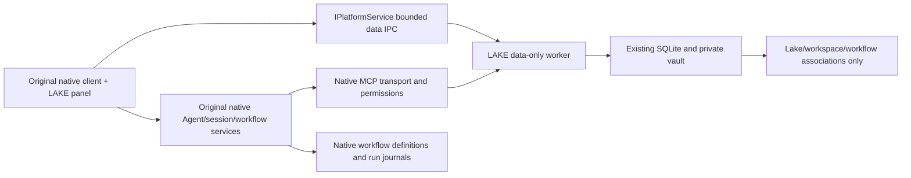

# LAKE on the original ZCode client and CLI

The user's 2026-10-02 scope supersedes the Wails frontend and Lake operations workflow requirements in lake-typescript.md. Use the original native Electron client and original CLI. LAKE adds lake/resource data and association metadata, with LAKE product wording. Native ZCode owns sessions, tasks, tools, permissions, terminal/browser/CUA, plugins/Skills, models, context compaction, automation and workflow definitions/execution/history/artifacts.

LAKE data-worker IO opens the existing SQLite database (backed up before schema 20 upgrade) and private vault, without constructing the legacy Lake Agent/runtime/workflow scheduler. Strict bounded native platform IPC exposes only data commands. Renderer components consume a hook and IPlatformService. Agent tools enter through the native MCP loader and native permission pipeline. A workspace must be explicitly linked to a lake before it receives that lake's resources; current_lake is UI selection and never supplies implicit execution authority.

Store workspace and native saved-workflow association metadata in dedicated lake_native_workspace and lake_native_workflow metadata tables. The metadata contains stable lake IDs, workspace identity/path and native workflow names only; no copied workflow source, nodes, runs, status or credentials. Native saved workflows remain in native storage, and existing native list/launch/open-run/open-artifact components provide the workflow interface. Cross-lake rebinding must be explicit and cannot mutate an admitted native run's scope.

Do not activate old LAKE workflow definitions or schedules in the new client. Preserve old data for historical read/export and backups; absence of the previous runner does not delete user history. CLI launch must reach original ZCode commands directly, with a separate explicit data/migration subcommand. The signed macOS launcher remains the only entry for legacy secret migration; normal data operations never read Keychain.

Native Electron packaging reuses original source build/runtime asset contracts, changes application display identity to LAKE and retains upstream attribution. Install only a verified signed app, retaining the previous app backup. Existing native protocols and workspace owner/lease semantics remain intact. Test lake-scoped metadata, native saved-workflow routing, navigation during active native execution, data preservation and credential redaction with synthetic fixtures; record real provider/service limitations separately.

Node-targeted ESM Main/Host/Scheduler bundles must supply a module-scoped createRequire bridge for bundled CommonJS dependencies, including their built-in buffer/stream imports. Preload remains CommonJS. Verify actual packaged startup outside the source workspace, including the Scheduler and canonical provider JSON, so source dependencies cannot mask incomplete packages. Recreate generated runtime dependency directories during packaging to exclude stale workspace exports. Explicit secret migration opens only storage and vault; it must never construct the retired Agent or scheduler.

The signed launcher resolves the repository's adjacent zcode runtime or the installed app's adjacent lake-runtime directory; an explicit LAKE_ZCODE_DIR keeps precedence. Verify the installed launcher with an isolated LAKE_HOME and --help. Missing runtime directories fail before any credential access.

Runtime dependency collection resolves each dependency relative to its parent and identifies its package root by the matching manifest name. Nested package.json files that only declare CommonJS/ESM type are not package roots; preserving the real root is required for exports, relative assets and transitive dependencies. Cover that case with a synthetic packaging regression.

The native Agent bundle outside app.asar must carry its external runtime dependency closure (TypeScript workflow compiler, SSH and optional headless/PTY libraries) alongside its entry. It cannot resolve dependencies hidden inside app.asar. Default/scratch projects live under the LAKE root, and Finder/development app identities must remain distinct from upstream. Remote deployment uses source-built LAKE assets and cannot silently fall back to upstream binaries.

Isolation requirement (2026-10-02): all application data uses LAKE-owned locations (`~/.lake`, Electron `Application Support/LAKE`, project `.lake/`). Never load or migrate the original ZCode user configuration, sessions, providers, plugins, workflow definitions or caches implicitly. Keep native protocol/package identifiers; only filesystem namespace and product presentation change. `LAKE_HOME` explicitly isolates fixtures and custom installations. Verify against an untouched sentinel original-ZCode directory.
