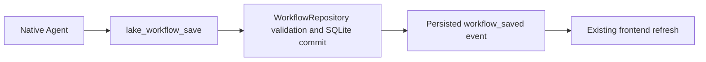

# Lake TypeScript operations backend

The `lake` managed module under `apps/zcode-cli/packages/lake/src` owns the Lake operations data layer and operations workflows. All other backend capabilities use existing ZCode implementations, as clarified by the user on 2026-10-02. The existing Wails/React frontend consumes the unchanged Lake desktop protocol. Go is a signed process launcher and native presentation boundary. It must not import a database, agent framework or operations service.

## Ownership and command path

`frontend/CLI → LakeRuntime → application command → typed adapter port → SQLite/vault/transport → journal + ordered event`

LakeRuntime owns operations workflow admission, Lake resource authorization, operations approval and workflow scheduler leases. ZCode owns Agent sessions, context/compaction, code tools, command proposals, terminal ownership, subagents/checkpoints, Skills/plugins/MCP and generic automation. The Lake adapter only forwards native requests/results and mirrors presentation history; it must not create competing implementations. SQLite is the sole durable data source. The desktop shell forwards commands and events without a second proposal queue or data cache. Runtime adapters alone access disk, network or processes. Domain validation has no IO. ZCode's native Agent executes model turns and calls Lake tools through the Lake adapter; no Eino fallback is permitted.

## Compatibility

Keep SQLite user_version 19 and the existing tables/JSON shapes and private file layouts. Port schema migrations 1–19, including version-8 event backfill, version-9/11 resource table rebuilds and version-17/18/19 column repairs. Back up a pre-existing older database privately before migration. Reject a future version. Existing journals stay append-only. Credentials remain under `~/.lake/secrets`; normal runtime never reads Keychain. A signed launcher may perform the explicit one-time legacy migration only.

Lake CLI actions, settings payloads, NDJSON bridge events and every current frontend method remain compatible. Workflows v1/v2, library and workflow schedules/grants remain Lake TypeScript services. Code tools, local/remote execution, subagents/checkpoints, hooks/plugins/skills and context compaction must call ZCode native TypeScript implementations. Keep old Lake records readable; do not reinterpret legacy metadata as active ZCode permissions or recreate old engines.

## Authorization and time

Freeze lake/resource/project identity at task admission. Read approval policy before dispatch; approval does not override resource authorization. Re-read target identity and authorization after approval and before credential access. A stale approval, cancelled turn, mismatched conversation or changed target cannot dispatch. Journal order is requested → proposed/approved or denied → started → completed/failed/unknown. Persist every accepted sequence before publishing it to the desktop stream.

The runtime owns one AbortController per admitted execution and terminal lease. Commands have stable IDs and cannot be executed twice by duplicate frontend replies. A failed transport after dispatch is unknown; resuming a conversation never automatically reruns it. Schedule claims use transactional leases and version/hash-bound grants. Desktop receives a continuous ordered stream; replay uses the same SQLite conversation sequence and repairs gaps. Agent answers and command output are untrusted content and cannot grant execution authority.

## Verification boundary

ZCode owns workspace and terminal execution through its public adapters/facade. The existing frontend is an API/event presentation adapter. Its dialogs answer native ZCode interactions; ZCode holds pending interactions and owns permission decisions. Lake SSH/Kubernetes/database workflow tools still enforce Lake authorization and append the Lake journal. The two boundaries do not maintain duplicate command queues. Native session persistence and context compaction remain enabled; legacy Lake conversation data is imported once through ZCode's history contract and retained in SQLite for compatibility.

The desktop host uses `@zcode/services/lake-host` for the existing ZCode file index, Git service and PTY terminal. The public entrypoint exports existing implementations; it introduces no replacement engine. Lake supplies registered project IDs and translates DTOs/events to the current frontend. PTY output is a native stream, so the adapter must not add shell completion markers, infer exit status from prompts or recreate Lake's terminal takeover queue. Native execution adapters are used for operations workflow local processes where required.

Legacy profile adapters reserve `lake-*.md` within the native Agent directory. Refreshing or deleting those generated profiles must preserve other native profiles.
Disabled legacy profiles are absent from native loading. The frontend edits only the imported name, description, instruction and enablement; legacy model, tool allowlist, turn limits and resource scope remain historical data rather than active native settings. Lake tools continue to enforce the parent conversation's authorization.

Remote workspaces use the public ZCode remote connection, SSH and service contracts. Lake supplies a currently authorized host, credential and registered root, verifies known host identity and exposes the same native PTY stream. A loopback SSH forward connects the remote native Agent to the desktop credential gateway. Native file writes use the native filesystem revision guard and a caller-provided content hash; a lost remote reply is uncertain and requires a fresh read. Operations schedules admit only version-bound Lake workflows and exact resource/command grants; ungranted unattended actions wait for approval without dispatch.

Use synthetic legacy databases and credentials only. Assert schema preservation, secret permissions/redaction, approval revocation, cancellation, idempotency, event replay and complete frontend method coverage. Build the source CLI with Node 24.14.0 and pnpm 10.33.2, run architecture checks and root/CLI typecheck/lint, test the current frontend and build/sign the desktop launcher. Do not mark complete while any old backend still serves an operations action.

The vendored source is nested in Lake's Git repository. Architecture changed-file discovery must request paths relative to its working directory so changed managed files are actually checked; paths outside the vendored root do not belong to this policy.

## Product identity and operations workflow authoring

ZCode Protocol create/resume accept an optional bounded `productIdentity` (name and instructions). Native ContextBuilder owns its composition: change the product prefix and identity while retaining native security, tools, Skills, memory and compaction. Omitted identity preserves upstream ZCode behavior. Lake supplies LAKE identity on both create and cold resume. Greeting replies must not advertise globally discovered Skills or their servers as current-lake capabilities. Existing historical replies are not rewritten.

The native Agent authors Lake operations definitions through `lake_workflow_save`, not through shell access to the database or the generic dynamic-workflow tools. Save/amend reuse WorkflowRepository validation, revisions and metadata journal. The current conversation injects the lake; literal resources must belong to the frozen conversation resource set. Saving only writes a definition and never dispatches inspections. Generic automation remains ZCode-owned.

Native failed-turn error codes are translated to fixed, credential-free LAKE messages. Context exhaustion must say context exhaustion, retain completed operations, and never automatically rerun a partially executed task. Raw provider errors, stack traces and request bodies never enter the frontend. Test native model-request identity on create/resume, definition creation without execution, frozen-resource rejection, optimistic amendment, sidebar refresh and context-exceeded error translation.
